# Airrohr Kit
 

Table of Contents
=================

   * [Introduktion](#introduktion)
   * [Airrohr-PCB](#airrohr-pcb)
      * [versions](#versions)
         * [Airrohr Wemos](#airrohr-wemos)
         * [Airrohr NodeMCU](#airrohr-nodemcu)
         * [luftdata.se Wemos](#luftdatase-wemos)
         * [luftdata.se NodeMCU](#luftdatase-nodemcu)
      * [Custom versions](#custom-versions)
         * [vekotinverstas.fi](#vekotinverstasfi)
   * [BOM (Bill Of Materials)](#bom-bill-of-materials)
      * [Hardware](#hardware)
      * [3D printed parts](#3d-printed-parts)
      * [For the PCB](#for-the-pcb)
   * [Assembly <em>(work in progress for the new parts)</em>](#assembly-work-in-progress-for-the-new-parts)

Created by [gh-md-toc](https://github.com/ekalinin/github-markdown-toc)

## Introduktion
I got involved in the Airrohr (Luftdaten, Luftdata.se) project in 2017 and it hadn't gained all that momentum yet so most parts was _(and still are)_ connected just with some dupont wires and stuffed into a pipe on the wall! It works but maybe not that pretty and to make it more stable something more sturdy then cables might be used.

Since I'm no programmer but wanted to contribute to the project in some way I started making 3D parts like a [stevensson screen](https://www.thingiverse.com/thing:2821592) for the sensor bit that to felt a bit bulky so this is a more streamlined version.

My goal with this project is to create a easy to use kit that can be made or ordered and requires minimal soldering skills and still looks good. For information about flashing firmware etc. please see [Luftdaten.info](http://luftdaten.info)

Now you have to choose a path, either you go all in and buy the electrical box, print all the parts for the complete kit or you just order the PCB and insert it into a standard pipe as the original.

This is how the finished assembly can look with the board showing. Imagine a lid on the box and another bend in the pipe!

| Electrical Box | Pipe |  
| ------------- | --------------- |  
| 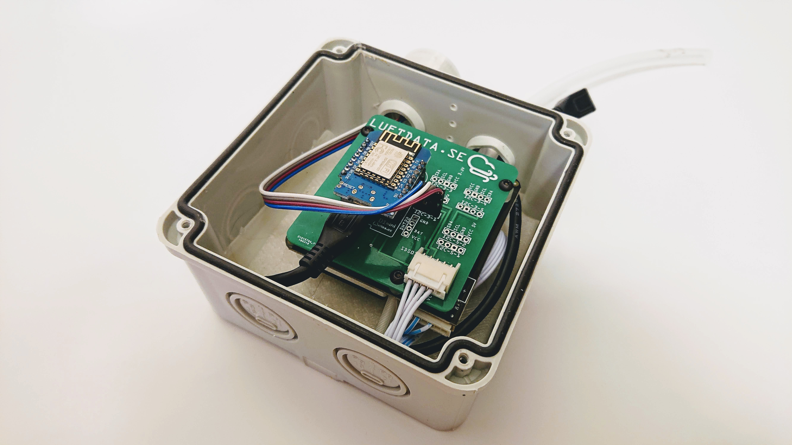 |  |

## Airrohr-PCB
So this is the main part, the _pièce de résistance_ as one might call it of this entire project! Solder on some header pins and insert the ESP8266 of your choice, connect the standard cables that comes with the SDS011 to the connector and you're ready!
The PCB also features:
 - 5 different I2C connectors at 3.3V for sensors
 - 2 different I2C connectors at 5V for LED, OLED etc.
 - 1 connection for [Adafruit ADS1115 16-Bit ADC](https://www.adafruit.com/product/1085) for DB meters and other analog sensors.

### versions
There are a couple different versions each in their own folder with Gerber files: 
*(Fritzing version is also available)*
#### Airrohr Wemos
This is labeled with the airrohr project name and good for general use. 
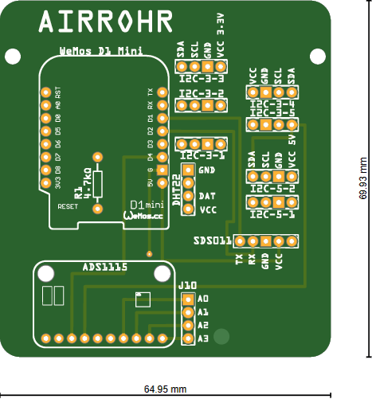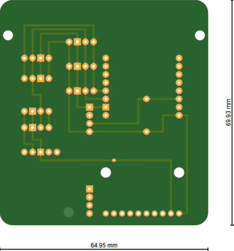 
Order at [Aisler](https://aisler.net/p/MCOILVZU)

#### Airrohr NodeMCU
This is made to fit either a NodeMCU v1, v2 or even the Lolin v3 that has a bigger footprint. 
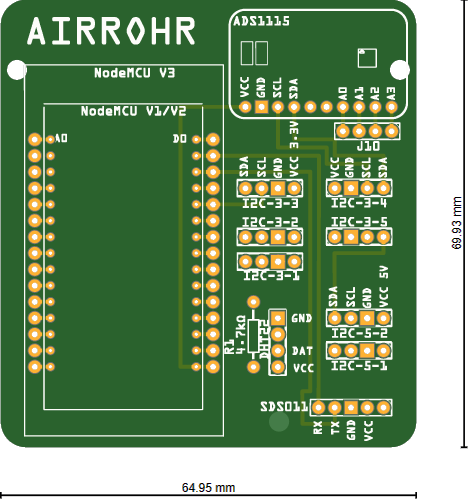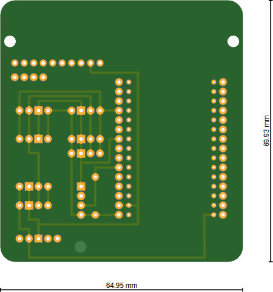 
Order at [Aisler](https://aisler.net/p/XHFMJADZ)

#### luftdata.se Wemos
This is labeled for the Swedish version of the project at [luftdata.se](http://www.luftdata.se) but other then that it's the same layout as the airrohr version above.  
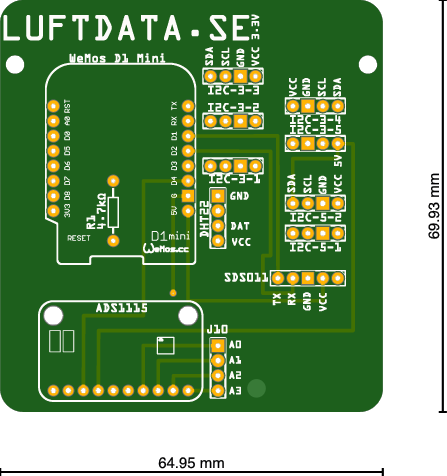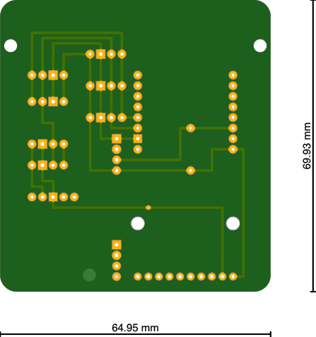 
Order at [Aisler](https://aisler.net/p/RLNYRZNS)

#### luftdata.se NodeMCU
This is labeled for the Swedish version of the project at [luftdata.se](http://www.luftdata.se) but other then that it's the same layout as the airrohr version above.  
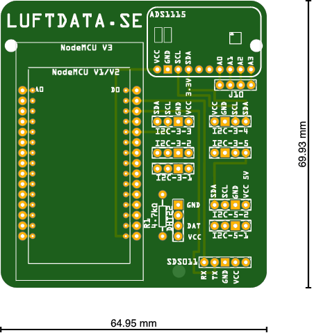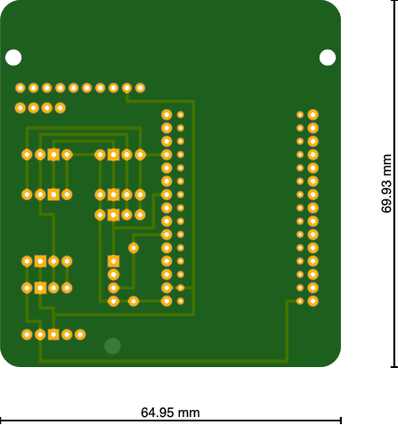 
Order at [Aisler](https://aisler.net/p/VWREQBIH)

### Custom versions

#### [vekotinverstas.fi](http://vekotinverstas.fi/)
This is a custom board I made for the Finnish iniative [vekotinverstas.fi](http://vekotinverstas.fi/) who uses the Wemos Mini Pro v2 instead and LoRaWan to be able to spread the sensors out in entire cities. Really impressive work so head over to their homepage and check it out _(google translate works well enough)_

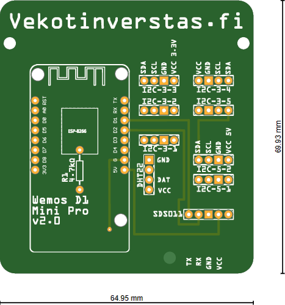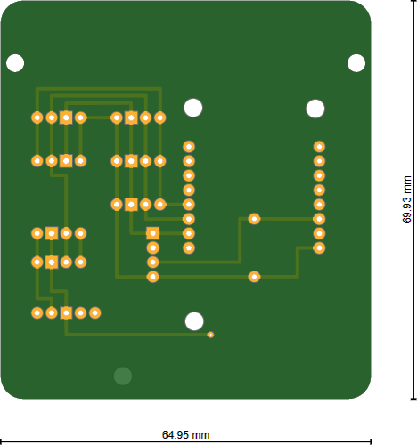 
Order at [Aisler](https://aisler.net/p/LDIEGBRF)

## BOM (Bill Of Materials)

### Hardware
 - SDS011 Particle sensor
 - ESP8266 (NodeMCU or Wemos D1 mini/pro)
 - Sensor (DHT22, BME280, BMP280 etc)
 - Electrical Box _(3D parts are custom for Biltema 46-2021, 116x116x76mm)_
 - Hose 6mm Inner diameter, 200mm long
 - 3x M3x12 screws
 - 1-4 Wood screws to attach to wall

### 3D printed parts
 - 3x 6mm spacer
 - 1x Airrohr stencil _(optional for painting)_
 - 1x Luftdata stencil _(optional for painting)_
 - 1x Airrohr wall mount
 - 1x Airrohr box sensor pipe _(For 28mm grommets)_
 - 1x Airrohr box sensor ring
 - 1x Airrohr box insert

### For the PCB
 - 2x 1x8 pin header for the wemos _(alternatively 1x15 for the NodeMCU)_
 - 1x4 pin header _(as many as the number of I2C components you want to add)_
 - 1x4 pin header for the DHT22
 - 1x 4.7kOhm resistor for the DHT22
 - 1x JST-XH 5-pin angled connector (800624)
 - 3x 6mm nylon spacers with nuts/screws or 3d printed alternative.

## Assembly _(work in progress for the new parts)_
Solder on all the headers/sockets that you want to use for your project 

Use the nylon spacers and screws/nuts to mount the board to the bottom of the SDS011 sensor and then connect the cable between the sensor and the board: 

The complete package is designed to fit into the 75mm sewer pipe system that the airrohr project uses for mounting and securing the sensor: 
 
_(dummy wemos on the image)_
