# Airrohr Kit
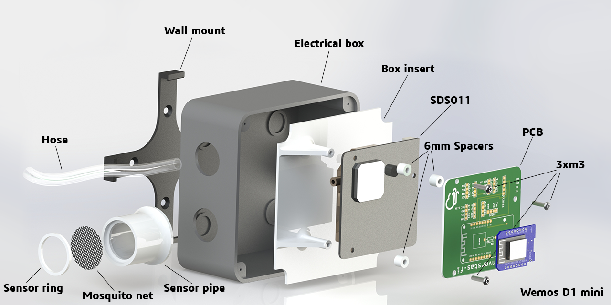 

I got involved in the Airrohr (Luftdaten, Luftdata.se) project in 2017 and it hadn't gained all that momentum yet so most parts was _(and still are)_ connected just with some dupont wires and stuffed into a pipe on the wall! It works but maybe not that pretty and to make it more stable something more sturdy then cables might be used.

Since I'm no programmer but wanted to contribute to the project in some way I started making 3D parts like a [stevensson screen](https://www.thingiverse.com/thing:2821592) for the sensor bit that to felt a bit bulky so this is a more streamlined version.

My goal with this project is to create a easy to use kit that can be made or ordered and requires minimal soldering skills and still looks good.

## BOM (Bill Of Materials)

This is just for these PCB's and not for a complete airrohr sensor altough the only thing you need besides this list is a SDS011 particle sensor.
- 1x Wemos D1 mini
- 2x 1x8 PCB socket for the wemos
- 1x4 PCB socket (as many as the number of I2C components you want to add)
- 1x4 PCB socket for the DHT22
- 1x 4.7kOhm resistor for the DHT22
- 1x JST-XH 5-pin angled connector (800624)
- 6x 6mm nylon spacers with nuts/screws

## Airrohr-PCB
So this is the main part, the _pièce de résistance_ as one might call it of this entire project!

### versions
There are a couple different versions each in their own folder with Gerber files: 
*(Fritzing version is also available)*
#### airrohr Wemos
This is labeled with the airrohr project name and good for general use.
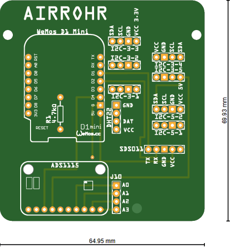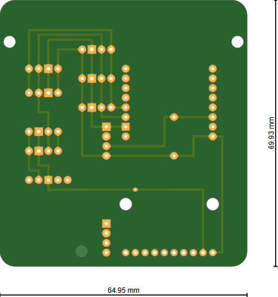 

#### Airrohr NodeMCU
This is made to fit either a NodeMCU v1, v2 or even the Lolin v3 that has a bigger footprint.
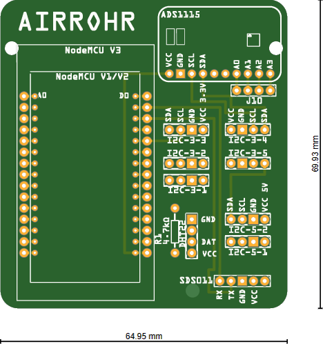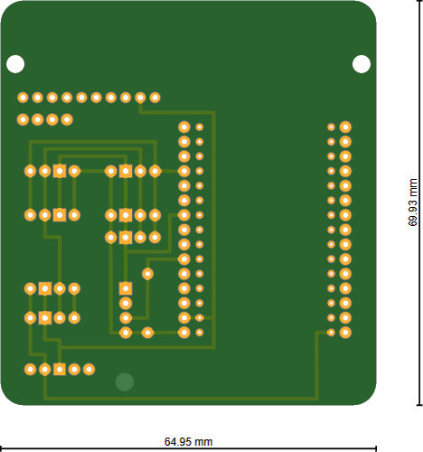 

#### luftdata.se Wemos
This is labeled for the Swedish version of the project at [luftdata.se](http://www.luftdata.se) but other then that it's the same layout as the airrohr version above.  
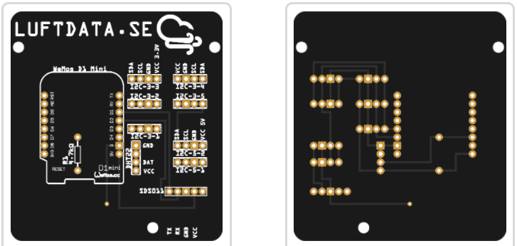 
 

#### luftdata.se NodeMCU
This is labeled for the Swedish version of the project at [luftdata.se](http://www.luftdata.se) but other then that it's the same layout as the airrohr version above.  
 
 

### Custom versions

#### [vekotinverstas.fi](http://vekotinverstas.fi/)
This is a custom board I made for the Finnish iniative [vekotinverstas.fi](http://vekotinverstas.fi/) who uses the Wemos Mini Pro v2 instead and LoRaWan to be able to spread the sensors out in entire cities. Really impressive work so head over to their homepage and check it out _(google translate works well enough)_

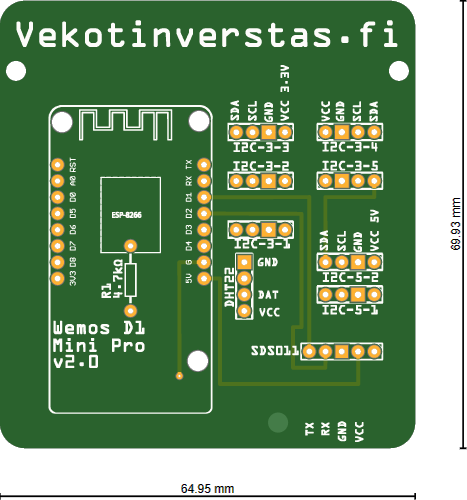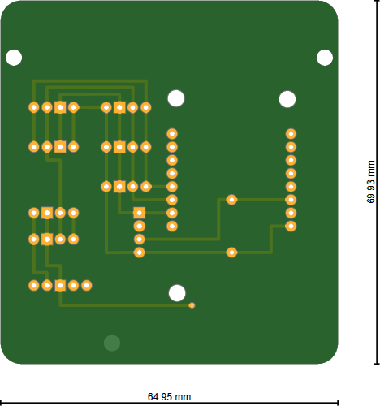 

## Assembly
Solder on all the headers/sockets that you want to use for your project 
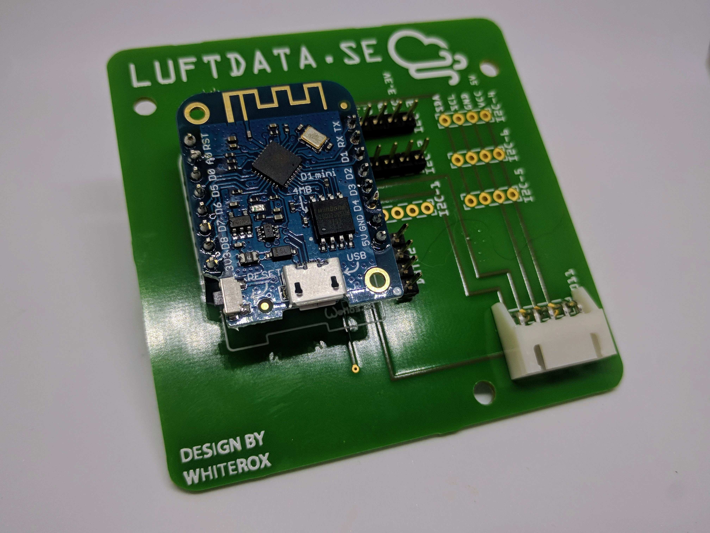

Use the nylon spacers and screws/nuts to mount the board to the bottom of the SDS011 sensor and then connect the cable between the sensor and the board: 
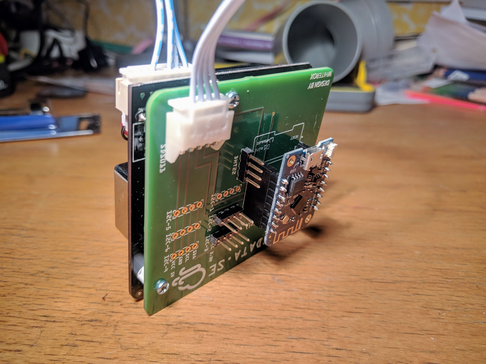

The complete package is designed to fit into the 75mm sewer pipe system that the airrohr project uses for mounting and securing the sensor: 
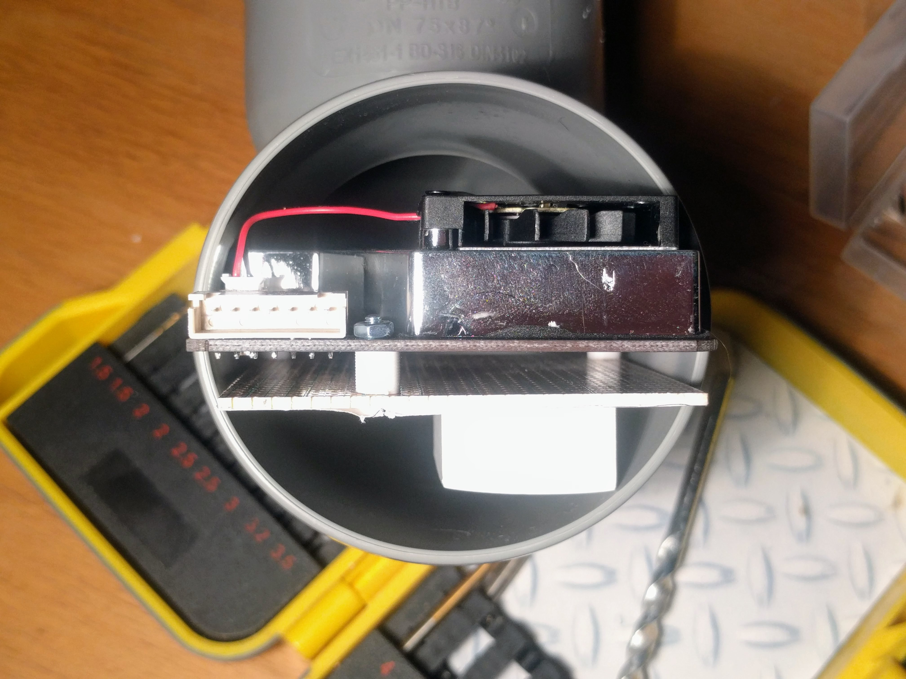 
_(dummy wemos on the image)_
