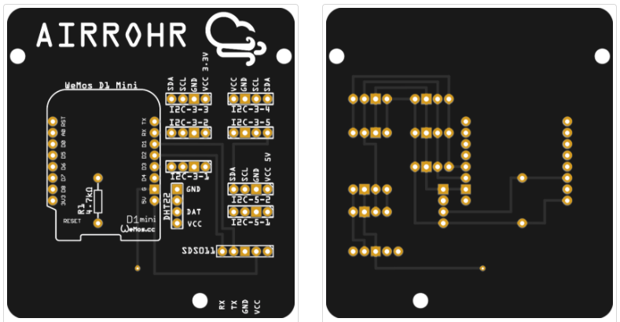
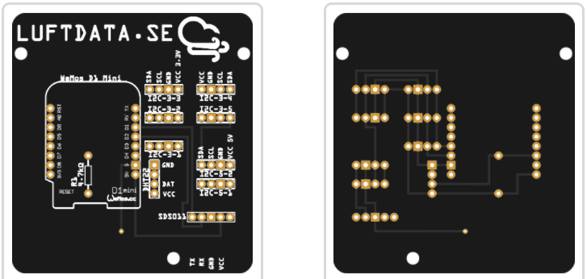
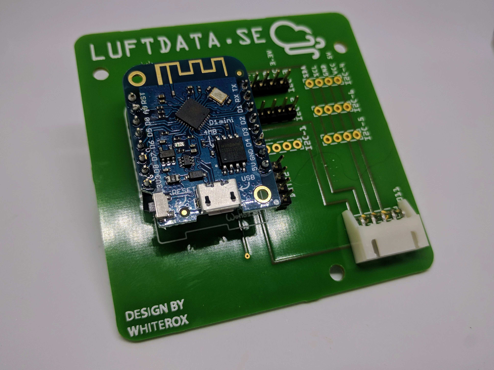
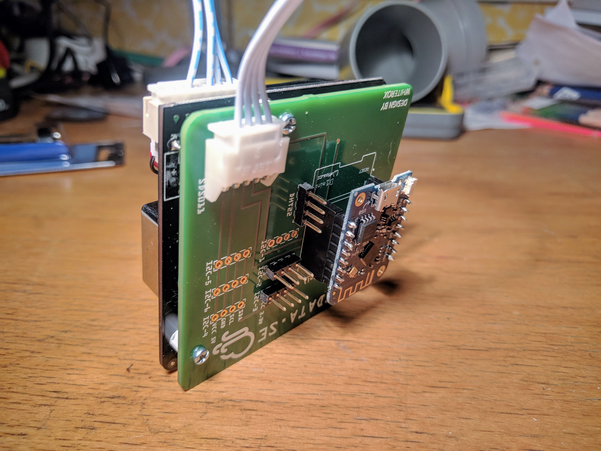
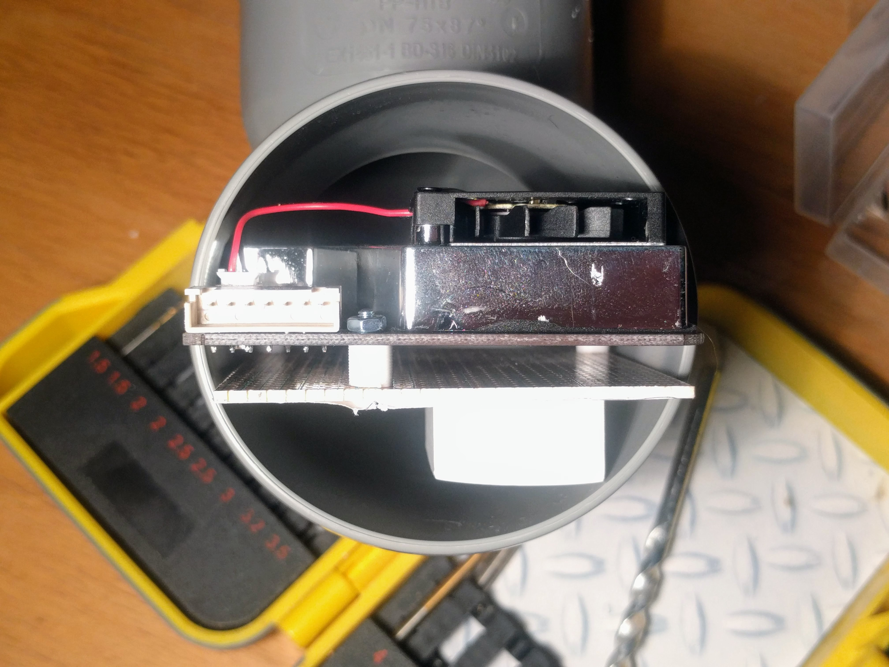

# Airrohr-PCB
A PCB for the airrohr project located at [luftdaten.info](http://www.luftdaten.info), a citizen science project to measure air particles (PM10 & PM2.5).

## Versions
There are 2 different versions each in their own folder with Gerber files: 
*(Fritzing version is also available)*
### airrohr
This is labeled with the airrohr project name and good for general use.

### luftdata.se
This is labeled for the Swedish version of the project at [luftdata.se](http://www.luftdata.se) but other then that it's the same layout

## BOM (Bill Of Materials)

This is just for these PCB's and not for a complete airrohr sensor altough the only thing you need besides this list is a SDS011 particle sensor.
- 1x Wemos D1 mini
- 2x 1x8 PCB socket for the wemos
- 1x4 PCB socket (as many as the number of I2C components you want to add)
- 1x4 PCB socket for the DHT22
- 1x 4.7kOhm resistor for the DHT22
- 1x JST-XH 5-pin angled connector (800624)
- 6x 6mm nylon spacers with nuts/screws

## Assembly
Solder on all the headers/sockets that you want to use for your project 

Use the nylon spacers and screws/nuts to mount the board to the bottom of the SDS011 sensor and then connect the cable between the sensor and the board: 

The complete package is designed to fit into the 75mm sewer pipe system that the airrohr project uses for mounting and securing the sensor: 
 
_(dummy wemos on the image)_
